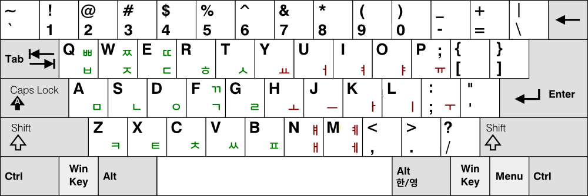
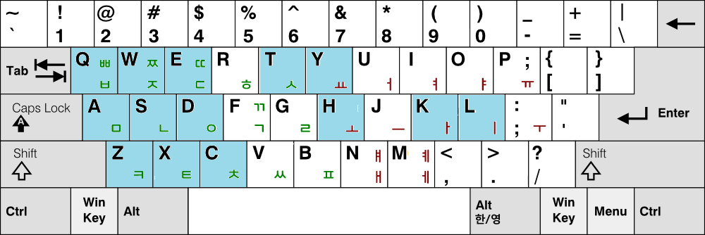

# 두줄이 자판 (Dujul-e Keyboard)

## 일반 설명 링크

이 문서는 개발자를 위한 문서입니다.
일반 사용자를 위한 두줄이 자판의 설명과 사용법은 다음 링크에서 보실 수 있습니다.

- 자판 설명: https://blog.naver.com/eekdland/224252538464

---

## 프로젝트 개요

두줄이 (두벌식 줄맞춤 e) 자판은 표준 두벌식의 구조적 연속성을 유지하면서

입력 효율과 피로도를 개선하기 위해 설계된 한글 입력 배열입니다.

기존 자판을 완전히 대체하기보다는

영어 자판의 Colemak 자판처럼 **기존 사용자 경험을 유지한 상태에서 성능을 개선하는 것**을 목표로 합니다.

---

## 배열도

<p style="text-align:center">
  
</p>

---

## 문제 정의

기존 두벌식 표준 자판은 다음과 같은 한계를 가지고 있습니다:

- 특정 손가락에 입력 부담이 있는 편
- 입력 효율보다는 표준화에 초점이 맞춰져 있음

이로 인해 장시간 타이핑 시 피로도가 증가하고,

입력 흐름이 비효율적으로 나타나는 문제가 존재합니다.

---

## 접근 방식

본 프로젝트는 기존 자판을 부정하는 것이 아니라,

```
기존 구조를 유지하면서 성능을 개선할 수 있는가?
```

라는 질문에서 출발했습니다.

---

## 핵심 설계 전략

### 1. 줄 정렬 기반 구조 재설계

- 상단열: 주로 예사소리 - 이중모음 중심
- 중단열: 주로 울림소리 - 단모음 중심
- 하단열: 주로 거센소리 - 단모음화 이중모음 중심

효율성의 한도 내에서 자음 배치를 **음운적 성질 + 물리적 위치** 기준으로 정렬

또한 중성 역시 성분별로 **줄맞춤 규칙**을 갖도록 설계하여

입력 구조의 일관성을 확보했습니다.

---

### 2. 빈도 기반 최적화

자주 사용되는 자모를 더 편한 위치로 이동시켜:

- 손가락 이동 거리 감소
- 입력 리듬 단순화
- 타이핑 피로도 감소

를 달성했습니다.

---

### 3. 손가락 부담 분산

기존 두벌식의 문제였던:

```
손가락 분산의 상대적 저조
```

를 완화하고,

```
리머의 법칙에 따른 좌우 및 손가락 간 사용량 분산
```

을 목표로 설계되었습니다.

---

## 설계 결과

두줄이 자판은 다음과 같은 특징을 갖습니다:

- 구조적 정렬을 통한 **입력 패턴 단순화**
- 손가락 분산을 통한 **피로도 감소**
- 기존 사용자 경험을 유지하면서 **효율 개선**
- 표준 두벌식과 **14개 글쇠 공유** → 낮은 학습 비용

<p>
  
</p>

---

## 분석 결과

> 코퍼스 기반 분석 결과, 두줄이 자판은 표준 두벌식 대비 전반적인 타이핑 피로를 감소시키는 구조를 보였습니다.
> 

두줄이 자판은 다음 세 가지 지표에서 모두 개선을 보였습니다:

- 손 이동 피로: **감소**
- 글쇠 피로: **감소**
- 손 꼬임 피로: **감소**

### 비교 결과

| 자판 이름 |	평균 피로 (손 이동) |	평균 피로 (글쇠) |	평균 피로 (손 꼬임) |	평균 피로 (가위질 패턴) | 손가락 분산 패널티 |	총 피로 (자모에 대한 평균) |
| --- | --- | --- | --- | --- | --- | --- |
| 두벌식 표준 |	0.3820 | 0.8661 |	1.0909 | 0.1124 |	0.0042 |	2.5783 |
| 두벌식 박영효-송계범 |	0.3554 | 0.8408 |	1.0876 | 0.0911 |	0.0338 |	2.5277 |
| 두벌식 겹받침 e |	0.2842 |	0.8504 |	1.1269 | 0.1060 |	0.0163 |	2.4722 |
| 두벌식 겹받침 e (부가기능 사용) |	0.2837 |	0.8060 |	1.1120 | 0.1062 |	0.0051 |	2.3990 |
| 두벌식 줄맞춤 e |	**0.2893** |	**0.8239** |	**1.0941** | **0.0878** |	**0.0085** |	**2.3931** |
| 두벌식 줄맞춤 e (부가기능 사용) |	**0.2539** |	**0.8055** |	**1.0812** | **0.0842** |	**0.0056** |	**2.3104** |

### 해석

- 박영효-송계범 자판은 표준 두벌식의 구조적 문제를 일부 완화한 배열로,
실제로 피로도가 소폭 감소하는 것을 확인할 수 있습니다.
- 두겹이 (두벌식 겹받침 e) 자판은 표준 두벌식에서 ㅆ과 같은 겹받침 글쇠를 추가한 배열로 피로도가 더욱 감소하였습니다.
- 두줄이 자판은 이보다 더 나아가, **총 피로 지표에서 추가적인 감소를 달성**하였습니다.
- 부가기능은 시프트 락, 대체시프트 식 순아래 입력, 겹받침 확장, 기호 확장, 약어 확장 등이 지원되며 이를 사용하면 **총 피로 지표가 더욱 감소**됩니다.

### 결론

두줄이 자판은 단순한 재배치가 아니라,  

**두벌식 구조를 유지하면서 반복되는 부담 전이를 줄이는 방향으로 최적화된 배열입니다.**

특히 장시간 타이핑 환경에서:
> **표준 두벌식 대비 누적 피로를 유의미하게 감소시킬 수 있는 구조**입니다.
>

---

## 포지셔닝

본 프로젝트는 한글 자판 체계에서 다음과 같은 위치를 가집니다:


- 두벌식 겹받침 e (두겹이) 자판 → 입력 안정성 개선
- 두벌식 줄맞춤 e (두줄이) 자판 → 입력 효율 최적화
- 세벌식 모아치기 e (세모이) 자판 → 입력 방식 확장


즉,

```
완전한 대체가 아니라
“기존 체계 위의 최적화 레이어”
```

입니다.

---

## 설계 철학

이 프로젝트는 다음 관점을 기반으로 합니다:

```
입력 방식은 사용 목적에 따라 개선 가능한 도구이다
```

따라서,

```
표준을 유지하면서도
성능 개선을 시도하는 접근
```

을 취합니다.

---

## 현재 상태

- 정식 버전 발표
- 실제 사용 피드백 기반 분석 및 개선 진행

---

## 결론

두줄이 자판은

기존 두벌식 사용자에게 익숙함을 유지하면서도,

```
입력 효율과 손가락 부담을 개선하기 위한
실용적인 재배치 자판 설계 프로젝트
```

입니다.

---

## 개발자를 위한 규격

두줄이 자판의 기본 버전은 다음 요소들을 필수로 포함합니다:

- 두줄이 자판 기본 배열
- 표준 두벌식 호환 낱자 결합 규칙

따라서 부가기능 포함 버전 등 파생 구현체들은, 기본 버전의 규격을 유지한 상태에서 추가 기능을 선택적으로 포함할 수 있습니다.

추가 기능의 예시는 다음과 같습니다:

- 겹받침 확장  
  - i, j, k, l 글쇠를 겹받침 입력 상태로 일시 전환
  - 이중모음과 충돌할 경우 이중모음 입력을 우선 적용
- 겹받침 및 이중모음 모아치기 (낱자 결합을 일반 및 역순으로 지원)
- 대체 시프트 기반 순아래 입력
- 시프트 락
- 기호 확장
- 약어 기능
- 모바일 최적화

---

## 두줄이 자판 모아치기에 대하여

해당 부분에 대해서는 [링크](https://github.com/Sinseiki/Dubeolsik_Moachigi)를 참고하시기 바랍니다.

이 두줄이 자판 모아치기 구현을 위해서는 다음과 같은 요소들이 필요합니다:

- 겹받침 및 이중모음 모아치기 (낱자 결합을 일반 및 역순으로 지원)

---

## 참고 사항

이 자판과 저장소는 공공성을 위하고 독점화를 막기 위해 [CC BY-SA 4.0](https://creativecommons.org/licenses/by-sa/4.0/legalcode.ko) 라이선스로 공개되어 있습니다.

또한 원칙은 아니지만, 다른 곳에 소개하실 때 ssgi.kr 를 함께 표시해주시면 감사드리겠습니다.


본 자판 XML 파일은 날개셋 입력기의 설정 형식을 사용합니다.

날개셋 입력기 자체의 저작권은 제작자 [김용묵](http://moogi.new21.org) 님께 있습니다.

---

## 연관 자판 프로젝트

이 저장소들은 한국어 키보드 배열 및 타자 인체공학에 관하여 진행 중인 연구 프로젝트의 일부입니다.

| 이름 | 설명 |
| --- | --- |
| [세벌식 모아치기 e (세모이)](https://github.com/Sinseiki/Semo-e_keyboard) | 입력을 압축하는 준속기 자판 |
| [**두벌식 줄맞춤 e (두줄이)**](https://github.com/Sinseiki/Dujul-e_keyboard) | **표준 두벌식 응용 효율 개선 자판** |
| [두벌식 겹받침 e (두겹이)](https://github.com/Sinseiki/Dugyeob-e_keyboard) | 표준 두벌식 배열 기반 개선 자판 |
| [두벌식 자판 모아치기](https://github.com/Sinseiki/Dubeolsik_Moachigi) | 두벌식 자판의 모아치기 연구 |
| [타자 피로도 분석기](https://github.com/Sinseiki/typing-fatigue-analyzer) | 자판 연구를 위한 타자 피로도 분석 도구 |

※ 타자 피로도 분석기는 [Hyunjun Ji](https://github.com/isty2e) 님의 분석기를 기반으로 연구 및 수정되었습니다.